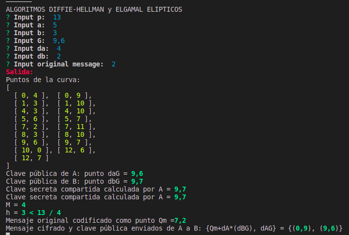

# Pŕactica 9:
## ALGORITMOS DIFFIE-HELLMAN y ELGAMAL ELÍPTICOS

* Objetivo: 
  * Implementar  el algoritmo  de  Diffie-Hellman  y  el cifrado  de ElGamal  en  sus versiones basadas en curvas elípticas.

* Modo compilación: 
  * `npm install` --> Para instalar todas las dependencias necesarias
  * `npm run start` --> Para compilar y ejecutar el programa

* Ejemplos de uso: 
  * 
  * 

