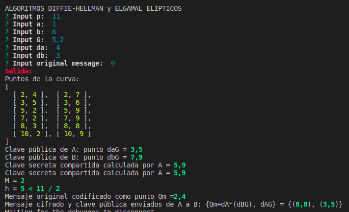

# Pŕactica 11:
## Menú con todas las prácticas incluyendo Feige-Fiat-Shamir

* Objetivo: 
  * Esta práctica debe contener en un menú todas las prácticas realizadas, incluyendo una implementación del protocolo de Feige-Fiat-Shamir tomando los datos secretos como entrada y el resto como salida. 

* Modo compilación: 
  * `npm install` --> Para instalar todas las dependencias necesarias
  * `npm run start` --> Para compilar y ejecutar el programa

* Ejemplos de uso: 
  * 

